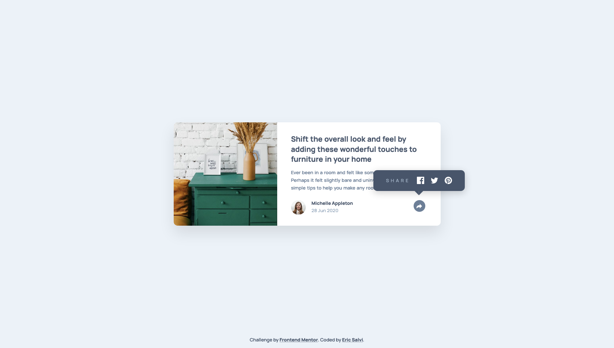

# Frontend Mentor - Article preview component solution

This is a solution to the [Article preview component challenge on Frontend Mentor](https://www.frontendmentor.io/challenges/article-preview-component-dYBN_pYFT). Frontend Mentor challenges help you improve your coding skills by building realistic projects. 

## Table of contents

- [Overview](#overview)
  - [The challenge](#the-challenge)
  - [Screenshot](#screenshot)
  - [Links](#links)
- [My process](#my-process)
  - [Built with](#built-with)
  - [What I learned](#what-i-learned)
  - [Continued development](#continued-development)
  - [Useful resources](#useful-resources)
- [Author](#author)

## Overview

### The challenge

Users should be able to:

- View the optimal layout for the component depending on their device's screen size
- See the social media share links when they click the share icon

### Screenshot

### Links

- Solution URL: [frontendmentor.io](https://www.frontendmentor.io/solutions/article-preview-and-the-mobilefirst-approach-using-flex-and-grid-9v1heqcHn)
- Live Site URL: [https://ericsalvi.github.io/article_preview_component/](https://ericsalvi.github.io/article_preview_component/)

## My process

### Built with

- Semantic HTML5 markup
- CSS custom properties
- Flexbox
- CSS Grid
- Mobile-first workflow
- BEM
- Visual Studio Code
- https://autoprefixer.github.io/
- axe DevTools for accessibility

### What I learned

I finally understood the mobile-first approach thanks to the wonderful guide from Kevin Powell over at freecodecamp.org. Link listed in the resources section.

### Continued development

From here on out, I plan on focusing on mobile-first design to help solidify this approach.

### Useful resources

- [Box Shadow CSS Generator](https://cssgenerator.org/box-shadow-css-generator.html) - This helped me with visually generating my box-shadow.
- [Mobile first approach](https://www.freecodecamp.org/news/taking-the-right-approach-to-responsive-web-design/) - Kevin Powell wrote up a nice article on why you should being focusing on the mobile first approach.
- [A complete guide to grid](https://css-tricks.com/snippets/css/complete-guide-grid/) - Great cheatsheet from css-tricks.com to reference CSS grid.

## Author

- Website - [Eric Salvi](https://github.com/ericsalvi)
- Frontend Mentor - [@ericsalvi](https://www.frontendmentor.io/profile/ericsalvi)